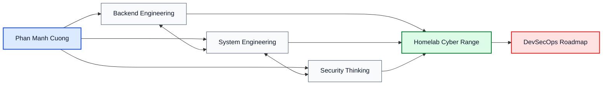

# Everything as Code, from Business Logic to Battle-Tested Infrastructure

  
  
  
  

  
  
  
  

## About Me

I am **Phan Manh Cuong**, a **3rd-year Information Systems student at PTIT** and a **Backend Intern** working across **.NET** and **Java**.

I do not see software as isolated source code. I see it as a living system that must be designed, deployed, secured, observed, and continuously improved. My core philosophy is simple:

> **Not just writing code, but mastering the entire lifecycle of a system.**

That is why my path is not limited to backend development. I am intentionally growing from backend engineering toward **DevSecOps**, with a strong focus on infrastructure ownership, automation, and security-first thinking.

Outside engineering, I am also a **regular apheresis donor**. That long-term discipline shapes how I work: steady under pressure, consistent in execution, and committed to creating value that lasts.

## The Mindset

Many developers stop at making features work.

I want to understand what happens **before**, **around**, and **after** the code runs:

- How the request is routed.
- How packets move through **Layer 2 / Layer 3**.
- How services are isolated, exposed, logged, and recovered.
- How infrastructure decisions affect reliability, performance, and security.

That is the difference I care about: moving from a developer who can ship application logic to an engineer who can reason about the full system, from API entrypoint to network boundary.

## The Proving Ground

My homelab is not a side project. It is my **cyber range** and engineering laboratory.

It runs on a **Dual Xeon 48-core platform**: not a datacenter cluster, but more than enough to build serious hands-on experience with virtualization, networking, automation, and system hardening under realistic conditions.

Inside the lab, I practice:

- **Proxmox Virtualization** for multi-node experiments and service isolation.
- **VyOS Networking** for routing, segmentation, firewalling, and traffic control.
- **Linux and Windows Server hardening** to reduce attack surface and enforce safer defaults.
- **Self-hosted workflows** to understand how systems behave beyond the IDE.

This is where theory becomes operational skill.

## 🏆 Featured Work

| Project | What it represents |
| --- | --- |
| [**roadmap-to-devsecops**](https://github.com/phanmanhcuongdev/roadmap-to-devsecops) | My personalized learning journey, homelab notes, and system hardening guides as I move from backend into DevSecOps. |
| [**student-feedback-system**](https://github.com/phanmanhcuongdev/student-feedback-system) | An enterprise-style backend project built with **.NET/Java architecture thinking**, focused on maintainability, clean boundaries, and real-world backend design. |

**Related build in progress:** [translation-ai-worker](https://github.com/phanmanhcuongdev/translation-ai-worker) is being developed as a supporting backend worker service for the broader ecosystem around `student-feedback-system`.

## Tech Stack

### Backend Engineering

  
  
  
  
  
  
  

### Containers, Automation & Delivery

  
  
  
  
  

### Operating Systems & Tools

  
  
  
  
  
  
  
  

My stack is shaped by one priority: build backend systems that are not only functional in development, but also understandable, operable, and defensible in real environments.

## Engineering Map

## The Journey

My roadmap is structured in stages, each one adding a deeper layer of control over the system:

1. **Infrastructure as Code**  
   Standardize provisioning, reduce manual drift, and make environments reproducible.

2. **Kubernetes & Orchestration**  
   Move from container usage to orchestrated, production-minded service management.

3. **Security in the Pipeline**  
   Integrate scanning, policy thinking, and secure delivery practices into CI/CD.

4. **Observability & Operational Maturity**  
   Build visibility through logs, metrics, tracing, and incident-aware system design.

## Contribution & Stats

  
  

  

## Closing Note

I am building toward a version of engineering where backend, infrastructure, and security are not separate tracks.

They are one system.

If you are interested in backend architecture, homelab engineering, infrastructure automation, or the road from **Backend Intern** to **DevSecOps Engineer**, we are probably building in the same direction.

> "Security is not a gate at the end. It is a property of systems designed with discipline from the start."
