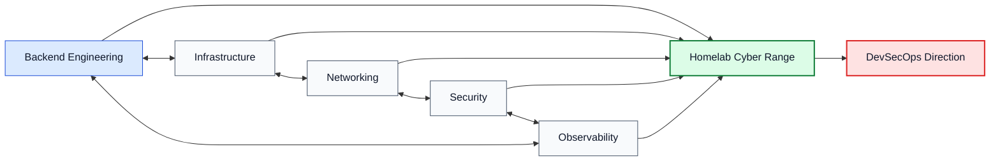

# Everything as Code, from Backend Logic to Operated Infrastructure

  
  
  
  

  
  
  
  

## About Me

I am **Phan Manh Cuong**, a **3rd-year Information Systems student at PTIT** and a **Backend Intern** working across **.NET** and **Java**.

I do not see software as isolated source code. I see it as a system that has to be designed, deployed, secured, observed, recovered, and improved over time.

My direction is clear:

> **From backend development to DevSecOps — not by theory alone, but by operating real systems.**

I care about what happens after the code leaves the IDE: how services are deployed, how traffic reaches them, how logs and metrics expose problems, how failures are recovered, and how security decisions are built into the system from the beginning.

Outside engineering, I am also a **regular apheresis donor**. That long-term habit shapes the way I work: steady, consistent, and committed to building value that lasts.

## What I Actually Operate

My homelab is my personal engineering ground. It is not only a collection of machines, but a small environment where I practice infrastructure, networking, observability, and security under real constraints.

### Core Infrastructure

My homelab runs on a **Dual Xeon E5-2676 v3 platform (24 Cores / 48 Threads)** with 64GB RAM and a GTX 1050Ti, combining both physical networking gear and hypervisor infrastructure. This environment provides realistic conditions to build, break, and secure systems from Layer 2 up to the application layer.

The environment includes:

* **Hybrid Networking & Routing:** Operating physical switches and routers (Cisco, Mikrotik RB450G, RB2011) alongside virtualized **VyOS** instances for deep packet routing, VLAN segmentation, and firewalling.
* **Secure Access & Overlay Networks:** Managing a self-hosted VPN mesh network using **Headscale & Tailscale** (with custom domain routing via `headscale.cuongdso.id.vn`) and enforcing strict **VPN ACLs** for zero-trust access control.
* **Proxmox Virtualization:** Orchestrating multiple VMs and LXC containers (Ubuntu Server, Kali Linux) for strict service isolation, security testing, and self-hosted workflows (RabbitMQ, MinIO, Ollama for local AI).
* **Full-Stack Observability:** Instrumenting the entire infrastructure with **Prometheus, InfluxDB, Loki, and Grafana** to capture metrics, aggregate logs, and monitor system health in real-time.

This is where theory becomes operational skill, debugging deep into how packets travel and how systems recover.

## Engineering Mindset

Many developers stop when the feature works.

I want to understand the full path around that feature:

* How the request enters the system.
* How traffic moves across Layer 2 and Layer 3.
* How services are isolated and exposed.
* How logs, metrics, and alerts help during failure.
* How access is controlled.
* How recovery works when SSH, VPN, or routing breaks.
* How documentation prevents the system from becoming tribal knowledge.

That is the kind of engineering I am building toward: backend logic with infrastructure awareness, security thinking, and operational maturity.

## Operational Lessons I Care About

My homelab has taught me that infrastructure is not only about tools. It is about discipline.

Some principles I try to follow:

* **Always keep a recovery path.** VPN, SSH, and reverse proxy are useful, but console access can save the system when networking fails.
* **Expose less by default.** Private mesh access is often better than public exposure.
* **Monitor for understanding, not decoration.** Dashboards should help explain system behavior during incidents.
* **Document the network.** If the topology only exists in your head, it will eventually become a problem.
* **Treat security as part of design.** Hardening, access control, and logs should not be added only at the end.
* **Respect physical constraints.** Power, heat, and cost are also architecture concerns.

## Featured Work

| Project / System | What it represents |
| --- | --- |
| [**roadmap-to-devsecops**](https://github.com/phanmanhcuongdev/roadmap-to-devsecops) | My personalized learning journey, homelab notes, and system hardening guides as I move from backend toward DevSecOps. Structured phases covering Infrastructure as Code, Kubernetes orchestration, security in CI/CD pipelines, and observability maturity. |
| [**student-feedback-system**](https://github.com/phanmanhcuongdev/student-feedback-system) | An enterprise-style academic project: Java 21 + Spring Boot 4 backend with Hexagonal Architecture, React 19 frontend, Microsoft SQL Server, Flyway migrations, JWT auth, email verification (Resend), MinIO document storage, WebSocket notifications, audit logging, and PDF/XLSX reporting via BIRT. |
| [**translation-ai-worker**](https://github.com/phanmanhcuongdev/translation-ai-worker) | A backend worker service consuming RabbitMQ translation requests, generating bilingual (Vietnamese/English) content for survey feedback workflows. Integrated with the student feedback system. |
| **Homelab Mesh Infrastructure** | A private network environment using Headscale/Tailscale, Proxmox, VyOS, Prometheus/Grafana stack, and security layers including network segmentation and access control. |
| [**FaizGear**](https://github.com/phanmanhcuongdev/FaizGear) | A Faiz Phone (Kamen Rider 555) simulator built with Jetpack Compose. Acts as a Zero-Trust IoT remote controller for Proxmox homelab via Tailscale API, featuring authentic UI, gapless audio sequences, and haptic feedback. |
| [**headscale-infra**](https://github.com/phanmanhcuongdev/headscale-infra) | Documentation and configuration for self-hosted Headscale + Nginx overlay network infrastructure. Includes architecture, deployment flow, debugging reports, and troubleshooting guides. |

## Tech Stack

### Backend Engineering

  
  
  
  
  
  
  

### Infrastructure, Networking & Operations

  
  
  
  
  
  
  

### Networking & Security Infrastructure

  
  
  
  
  
  
  

### Containers, Delivery & Observability

  
  
  
  
  
  
  
  

### Observability & Data

  
  
  
  
  
  

## Engineering Map

```mermaid
flowchart LR
    A[Backend Engineering]
    B[Infrastructure]
    C[Networking]
    D[Security]
    E[Observability]
    F[Homelab Cyber Range]
    G[DevSecOps Direction]

    A --> F
    B --> F
    C --> F
    D --> F
    E --> F
    F --> G

    A <--> B
    B <--> C
    C <--> D
    D <--> E
    E <--> A

    style F fill:#dcfce7,stroke:#15803d,stroke-width:2px,color:#0f172a
    style G fill:#fee2e2,stroke:#dc2626,stroke-width:2px,color:#0f172a
    style A fill:#dbeafe,stroke:#1d4ed8,color:#0f172a
    style B fill:#f8fafc,stroke:#475569,color:#0f172a
    style C fill:#f8fafc,stroke:#475569,color:#0f172a
    style D fill:#f8fafc,stroke:#475569,color:#0f172a
    style E fill:#f8fafc,stroke:#475569,color:#0f172a
```

## Current Direction

I am currently focusing on:

1. **Backend architecture**
   Building maintainable services with clear boundaries, practical API design, and database-aware thinking. Currently implementing enterprise patterns: Hexagonal Architecture, Ports & Adapters, JWT auth, Flyway migrations, transactional consistency.

2. **Infrastructure as Code**
   Reducing manual drift and making environments reproducible. Exploring OpenTofu and Ansible for infrastructure provisioning, and Kubernetes orchestration with K3s for production-mindedness.

3. **Private networking and secure access**
   Using mesh VPN patterns (Headscale, Tailscale) and network segmentation to reduce unnecessary public exposure. Implementing zero-trust principles and strict VPN ACLs.

4. **CI/CD and security in delivery**
   Moving security checks closer to the development workflow instead of treating them as a final gate. Exploring SonarQube, Trivy scanning, and container image validation.

5. **Observability and incident readiness**
   Building systems that can explain themselves when something goes wrong. Instrumenting with Prometheus, Grafana, Loki for metrics, logs, and visibility. Creating operational dashboards for understanding system behavior during failure.

## Contribution & Stats

  

  
  

## Closing Note

I am building toward a version of engineering where backend, infrastructure, networking, observability, and security are not separate tracks.

They are one system.

> "Security is not a gate at the end. It is a property of systems designed with discipline from the start."
