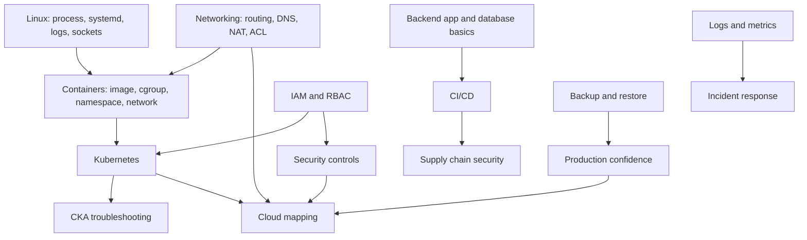

# DevSecOps Stack and Knowledge Map

This document is a stack and knowledge map for the tutorial handbook. It supports, but does not replace, `E:\Roadmaps\phanmanhcuongdev\12-month-devsecops-roadmap.md`.

Status labels used here:

- Current: already present or already used in the homelab context, but still needs evidence before making strong portfolio claims.
- Next to learn: useful for applying to DevSecOps / Platform / Infrastructure roles after the current roadmap gate allows it.
- Optional later: advanced or enterprise-oriented; do not pull into the active plan unless an ADR proves the need.
- Enterprise equivalent: common company-side implementation of the same concept, not a requirement to learn immediately.

## 1. Purpose

This document turns the 12-month roadmap into a practical stack and knowledge map. It helps keep learning focused, connects homelab work to company environments, and prepares interview stories for DevSecOps, Platform Engineer, and Infrastructure Engineer roles.

It is not a list of tools to collect. Each layer must answer:

- What problem does this solve?
- What concept is behind the tool?
- Which part is current, next to learn, optional later, or enterprise equivalent?
- What evidence proves competence?
- What interview story can be told from real work?

The intended direction stays the same as the source roadmap: evidence-first, foundation-first, anti-tool-sprawl, Break -> Measure -> Fix -> Document.

## 2. DevSecOps Is Not A Tool List

DevSecOps is the intersection of software delivery, infrastructure, security, reliability, and automation. Tools are implementation details. The durable skill is understanding the system behavior behind the tools.

A strong engineer can move between companies, clouds, and stacks because the underlying concepts transfer:

- routing, DNS, TCP, TLS, firewalling
- Linux processes, sockets, filesystem, systemd, logs
- container isolation, images, registries, cgroups, namespaces
- deployment strategy, rollback, health checks
- least privilege, identity, secrets, audit logs
- metrics, logs, traces, alerts, postmortems
- backup, restore, RTO, RPO, stateful failure
- cloud primitives mapped from local concepts

A tool belongs in the roadmap only when it has:

- a problem
- a concept
- an evidence plan
- a failure mode
- a review checklist

If the only reason to add a tool is that it sounds like DevSecOps, reject it.

## 3. Layered Stack Overview

| Layer | Problem it solves | Core knowledge | Homelab/current tool | Enterprise equivalent | Evidence to produce | Interview talking points |
| --- | --- | --- | --- | --- | --- | --- |
| Networking | Moves traffic predictably and isolates trust zones | OSI/TCP-IP, subnetting, VLAN, routing, NAT, ACL, DNS, TCP handshake | Current: router/firewall, VyOS/router concept, Tailscale overlay, domain/VPS paths | AWS VPC, Security Groups, NACLs, Transit Gateway, Cloudflare, enterprise firewall | Packet path diagram, `ip route`, `traceroute`, `tcpdump`, firewall/ACL excerpts, DNS proof | Explain request path, failure point, ACL decision, and rollback |
| Operating System / Linux | Runs services and exposes process/log/network state | process, PID, fd, socket, systemd, filesystem, permissions, journald | Current: Ubuntu/Debian VMs/LXC | RHEL/Ubuntu fleets, systemd services, golden images | `systemctl`, `journalctl`, `ss`, process tree, service failure postmortem | Debug service not listening, crash loop, permission issue |
| Virtualization | Provides isolated compute and lab reproducibility | hypervisor, VM, LXC, bridge, storage, snapshots, resource allocation | Current: Proxmox, VM/LXC | VMware, Hyper-V, OpenStack, cloud compute | VM inventory, Proxmox bridge diagram, backup/snapshot restore evidence | Explain VM vs container isolation and resource tradeoffs |
| Containers | Packages app runtime consistently | image, layer, container, bind mount, env, network, cgroup, namespace | Current: Docker, Docker Compose, Portainer if used | Docker, containerd, ECS task, Kubernetes Pod | Dockerfile/Compose, logs, port mapping, failed container debug | Explain why app runs locally but fails in container |
| Kubernetes / Orchestration | Schedules and manages workloads declaratively | Pod, Deployment, Service, Ingress, ConfigMap, Secret, Volume, RBAC, probes | Next to learn in Q2: Kubernetes/K3s after Q1 foundations | EKS, GKE, AKS, OpenShift | Minimal deployment, events/logs/endpoints evidence, CKA failure reports | Debug Service selector, bad rollout, readiness failure |
| CI/CD | Converts code changes into repeatable build/test/deploy flow | pipeline stages, artifacts, gates, environment promotion, rollback | Current/Next: GitHub, GitHub Actions if used for project pipeline | GitLab CI, Jenkins, GitHub Actions, Azure DevOps | Pipeline YAML, failed gate, successful deploy, rollback note | Explain release flow and why a bad change is stopped |
| Infrastructure as Code | Makes infra reproducible and reviewable | desired state, state file, drift, plan/apply, idempotence | Next to learn after foundations: Terraform/OpenTofu concept | Terraform Cloud, OpenTofu, Pulumi, Crossplane | One small VM/DNS/firewall codified, plan output, ADR | Explain drift and how code review changes infra safely |
| Configuration Management | Keeps hosts consistent after provisioning | idempotence, inventory, roles, templates, secrets boundary | Next to learn: Ansible for selected hardening/runbook tasks | Ansible, Salt, Puppet, Chef | One repeatable hardening or package config run with before/after evidence | Explain why manual SSH changes do not scale |
| Secrets Management | Prevents credentials from living in code/logs | secret lifecycle, rotation, least privilege, audit | Current concept: env/secrets discipline; Next: Vault/External Secrets concept | Vault, AWS Secrets Manager, GCP Secret Manager, Azure Key Vault | Fake secret drill, rotation note, redacted config, access policy | Explain why deleting leaked secret is not enough |
| Artifact / Container Registry | Stores versioned build outputs safely | artifact immutability, tag strategy, provenance, promotion | Current/Next: GitHub packages or Docker image tags if used | Harbor, GHCR, GitLab Registry, ECR/GCR/ACR | Image tag/version policy, pull failure, promotion evidence | Explain why latest tag is risky |
| Application Security | Finds and reduces app-layer risk | OWASP Top 10, authn/authz, input validation, session, rate limit | Next/Current if used: OWASP ZAP against test app | ZAP, Burp, enterprise DAST, AppSec review | ZAP report plus app/reverse-proxy log correlation | Explain finding, false positive, remediation, accepted risk |
| Supply Chain Security | Reduces dependency/image risk before deploy | SCA, SBOM, CVE severity, exploitability, provenance | Next: Trivy if used as evidence; SBOM concept | Trivy, Grype, Syft, Snyk, Dependabot, SLSA | Dependency/image scan, remediation note, exception ADR | Explain difference between vulnerability count and risk |
| Runtime Security | Detects suspicious behavior at runtime | syscall, process execution, container escape signals, host anomaly | Optional later: Falco/Wazuh/SIEM only after basics | Falco, Wazuh, EDR, SIEM | Controlled suspicious event and alert triage | Explain detection signal vs noise |
| Identity and Access Control | Controls who/what can access resources | authentication, authorization, RBAC, ACL, policy, least privilege | Current: Tailscale/Headscale ACL, SSH keys, app auth if present | IAM, SSO, Okta, Keycloak, Kubernetes RBAC, AWS IAM | ACL policy excerpt, denied access proof, break-glass ADR | Explain identity-based access vs source-IP-only filtering |
| Observability | Makes system behavior explainable | telemetry, signal, dashboard, alert, SLI/SLO concept | Current: Grafana, Prometheus if deployed, InfluxDB if used | Datadog, New Relic, CloudWatch, Grafana Cloud | Dashboard tied to real incident or lab, metric that moved | Explain metric used to decide root cause |
| Logging | Preserves event timelines and root-cause clues | structured log, timestamp, correlation, retention | Current: Loki if deployed, journalctl, reverse proxy logs, app logs | ELK/OpenSearch, Splunk, CloudWatch Logs, Loki | Log timeline for incident, query, retention note | Explain how logs proved the failure path |
| Metrics | Quantifies health and saturation | CPU, memory, disk, latency, error rate, queue depth | Current: Prometheus/node_exporter if deployed, Grafana, InfluxDB | Prometheus, CloudWatch Metrics, Datadog metrics | Before/after metric graph for failure/fix | Explain why a metric matters operationally |
| Tracing | Follows one request across services | span, trace id, propagation, latency breakdown | Optional later: OpenTelemetry after logs/metrics are useful | OpenTelemetry, Jaeger, Tempo, X-Ray | One traced request path when app is ready | Explain where latency is introduced |
| Database / Stateful Systems | Preserves correct and available data | ACID, isolation, indexes, locks, connection pools, migrations | Current: SQL Server/PostgreSQL; project DB | RDS, Cloud SQL, Azure SQL, managed Postgres | isolation/index lab, query plan, slow query, grants | Explain transaction anomaly and index tradeoff |
| Backup and Recovery | Restores service after loss/corruption | RTO, RPO, restore validation, consistency | Current/Next: backup scripts, DB dump/restore, Proxmox backup | AWS Backup, RDS snapshots, Velero, enterprise backup | Restore transcript, time measured, data verified | Explain why backup is not real until restored |
| Incident Response | Converts failure into learning and prevention | detection, triage, timeline, root cause, corrective action | Current process: postmortems from labs/incidents | PagerDuty/Opsgenie, ITSM, SOC process | Postmortem with evidence and runbook update | Explain one incident from symptom to prevention |
| Cloud Platform Mapping | Maps local concepts to managed cloud primitives | VPC, IAM, LB, object storage, managed DB, monitoring | Q4 only: AWS mapping after local proof | AWS/GCP/Azure | homelab-to-cloud mapping doc with local evidence path | Explain similarity and difference without false analogy |
| Documentation / ADR / Portfolio | Makes work reviewable and credible | ADR, runbook, architecture diagram, case study | Current: Markdown handbook/evidence docs | Confluence, Backstage, internal docs, RFCs | ADR collection, whitepaper, case studies | Explain decisions, tradeoffs, and remaining risk |

## 4. Recommended Practical Stack For My Learning Path

### Level 1 - Current Realistic Stack

Why this level exists:

This is the stack closest to the current homelab. It is enough to build credible evidence without adding tools for appearance. The goal is to prove fundamentals and operational discipline.

Stack:

| Area | Practical stack | Status |
| --- | --- | --- |
| Compute | Proxmox, Ubuntu/Debian VM, LXC | Current |
| App runtime | Docker, Docker Compose | Current |
| Access | Headscale/Tailscale, SSH keys | Current |
| Edge | Caddy/Nginx reverse proxy, domain, VPS path | Current if already deployed; evidence still required |
| Monitoring | Grafana, Prometheus, node_exporter, InfluxDB where already used | Current if deployed; use only as evidence layer |
| Logging | Loki, promtail, journalctl, reverse proxy logs, app logs | Current if deployed; evidence required |
| Security control | CrowdSec, firewall/ACL, Headscale/Tailscale ACL | Current if deployed; evidence required |
| Source control | GitHub | Current |
| CI/CD | GitHub Actions | Next if not already used on the target project |
| Security scan | Trivy, OWASP ZAP | Next/current only when tied to a lab |
| Data | SQL Server/PostgreSQL, MinIO if used, RabbitMQ if used | Current/project-dependent |
| Recovery | backup scripts, DB dump/restore, Proxmox backup | Current/Next; prove by restore |
| Evidence | Markdown docs, diagrams, postmortems, ADRs | Current |

What to build:

- Secure Student Feedback Deployment on VM/Docker Compose.
- Headscale/Tailscale access plane with ACL evidence.
- Observability dashboard tied to one real failure.
- Backup/restore drill for SQL Server or PostgreSQL.
- One ZAP/CrowdSec public exposure case study.

What evidence proves competence:

- packet path diagram and `tcpdump`/`traceroute` evidence
- `systemctl`, `journalctl`, `ss`, reverse proxy logs
- Grafana panel showing a metric moved during a lab
- Loki/journal query showing failure timeline
- ACL policy excerpt and denied access proof
- DB backup restore transcript and consistency check
- postmortem with root cause and prevention

What interview stories it enables:

- I debugged a failed request from DNS to process ownership.
- I separated public access from private admin access.
- I proved backup by restoring, not by assuming.
- I used logs and metrics to identify a failure instead of guessing.

### Level 2 - Apply-Ready DevSecOps Stack

Why this level exists:

This level matches what many companies expect from junior/mid DevSecOps, Platform, or Infrastructure candidates. It should be learned after Level 1 evidence exists, not as a replacement for fundamentals.

Stack:

| Area | Practical stack | Status |
| --- | --- | --- |
| Orchestration | Kubernetes/K3s | Next to learn in Q2 |
| Packaging | Helm | Next after basic Kubernetes objects are clear |
| Ingress | Ingress Controller concept | Next in Q2 |
| CI/CD | GitHub Actions or GitLab CI | Next/apply-ready |
| IaC | Terraform/OpenTofu | Next after network/infra model is stable |
| Config management | Ansible | Next for repeatable host config |
| Secrets | Vault concept, External Secrets concept | Next concept; implementation only with ADR |
| Registry | GHCR/GitLab Registry/Harbor concept | Next concept; choose one when needed |
| Supply chain | SBOM concept, Trivy, dependency scanning | Next/apply-ready |
| AppSec | SAST/DAST/dependency scanning | Next/apply-ready |
| Observability | centralized logging, alerting | Next/apply-ready |
| Access | IAM/RBAC | Next/apply-ready |
| Recovery | backup/restore drill for stateful app | Required evidence |
| Cloud mapping | AWS/GCP/Azure equivalents | Q4 mapping, not early goal |

What to build:

- Kubernetes deployment of a reduced Spring Boot service.
- CI pipeline that builds, tests, scans, and publishes an artifact.
- Helm chart or clean manifests for app deployment.
- RBAC-limited service account and denied-action evidence.
- Backup/restore drill for a stateful dependency.
- Alert tied to a real failure condition.

What evidence proves competence:

- `kubectl get/describe/logs/events` failure report
- failed rollout and rollback transcript
- CI pipeline failure from security gate
- scan report with remediation or exception rationale
- RBAC denial proof
- alert firing plus postmortem

What interview stories it enables:

- I deployed and debugged a service on Kubernetes.
- I built a pipeline that prevents known bad artifacts from shipping.
- I handled secret/config boundaries.
- I mapped homelab primitives to cloud primitives without overclaiming.

### Level 3 - Enterprise / Advanced Later

Why this level exists:

This level is useful for mature platform teams, but it should not be pulled into the active plan until Level 1 and Level 2 evidence exist. These tools can become distractions if they are installed before the problems are understood.

Stack:

| Area | Advanced stack | Status |
| --- | --- | --- |
| GitOps | Argo CD, Flux | Optional later |
| Admission policy | Kyverno, OPA Gatekeeper | Optional later |
| Runtime security | Falco | Optional later |
| SIEM | Wazuh, ELK/OpenSearch, Splunk concept | Optional later |
| Service mesh | Istio, Linkerd | Optional later |
| Kubernetes security | advanced Pod Security, NetworkPolicy, image signing | Optional later |
| Scale | multi-cluster, cluster lifecycle tooling | Optional later |
| Policy as code | OPA/Rego, Conftest | Optional later |
| Supply chain | SLSA, Sigstore, Cosign, in-toto | Optional later |
| Cloud security | CSPM, advanced IAM, org policies | Optional later |

What to build:

- Only build one of these when a previous lab exposes a real gap.
- Use ADR approval before adding it to the active path.

What evidence proves competence:

- policy denied unsafe workload
- signed image verified before deploy
- runtime alert tied to a controlled event
- SIEM timeline reconstructed from multiple sources

What interview stories it enables:

- I did not add advanced tooling until the simpler control had a proven gap.
- I can explain policy, runtime, and detection in terms of controls and evidence.

## 5. Knowledge Dependency Graph

Text dependency map:

- Network before Kubernetes.
- Linux before container debugging.
- Container before Kubernetes.
- CI/CD before supply chain security.
- IAM/RBAC before Kubernetes security.
- Observability before incident response.
- Backup/restore before production confidence.
- Cloud mapping after homelab concepts are understood.

## 6. Tool-To-Concept Mapping

| Tool | Category | Concept behind it | What I must understand | Common failure mode | How to prove I understand it |
| --- | --- | --- | --- | --- | --- |
| Proxmox | Virtualization | hypervisor, VM/LXC isolation, bridges, storage | VM vs LXC, bridge path, resource allocation, backup | VM unreachable, wrong bridge, disk pressure | topology diagram, bridge config, restore test |
| VyOS / router-firewall concept | Networking | routing, NAT, firewall, ACL, default deny | route table, return path, stateful firewall | asymmetric route, bad NAT, blocked port | `show route`, firewall rules, tcpdump before/after |
| Headscale/Tailscale | Access / identity network | overlay network, identity ACL, private admin path | control plane vs data plane, ACL tags, trust boundary | over-permit, node missing, SSH denied | ACL excerpt, `tailscale status`, denied/allowed test |
| Caddy/Nginx | Reverse proxy | ingress, TLS termination, routing, headers | host routing, upstream, TLS, logs | bad upstream, cert issue, wrong header | config excerpt, `curl -v`, access/error logs |
| Docker | Containers | image, container, cgroup, namespace, port mapping | image layers, env, volume, logs, network | wrong env, port not exposed, permission issue | Dockerfile/Compose, logs, `docker inspect`, curl test |
| Kubernetes | Orchestration | declarative desired state and reconciliation | Pod, Deployment, Service, Ingress, Secret, ConfigMap, RBAC | CrashLoopBackOff, bad selector, DNS failure | `kubectl describe/logs/events/endpoints` failure report |
| Helm | Packaging | parameterized Kubernetes manifests | chart values, templates, release lifecycle | wrong values, bad rendered manifest | `helm template`, diff, rollback evidence |
| GitHub Actions / GitLab CI | CI/CD | automated build/test/scan/deploy pipeline | stages, artifacts, secrets boundary, gates | secret leak, skipped gate, flaky pipeline | pipeline YAML, failed gate, fixed pipeline |
| Terraform/OpenTofu | IaC | desired state and drift control | state, plan/apply, resources, drift | state mismatch, accidental destroy | plan output, small infra change ADR |
| Ansible | Configuration management | idempotent host configuration | inventory, roles, templates, handlers | non-idempotent playbook, wrong host group | before/after config, repeated run with no change |
| Vault / secrets manager concept | Secrets | secret lifecycle, lease, rotation, audit | secret storage vs injection, access policy | leaked secret, expired token, over-permit | fake secret drill, policy, rotation note |
| Trivy | Supply chain / scanning | vulnerability detection in fs/image/deps | CVE severity, exploitability, false positive | noisy findings, ignored critical risk | scan report plus remediation/exception ADR |
| OWASP ZAP | AppSec / DAST | dynamic web security testing | auth context, request surface, finding validation | unauthenticated scan, false positive | ZAP report plus app/proxy log correlation |
| SonarQube / SAST concept | Code security | static analysis and quality gate | code smells vs security issue vs dependency risk | treating SAST as full AppSec | finding triage and fix evidence; not current, learn later |
| Prometheus | Metrics | scrape-based time series | target, metric, label, alert expression | target down, high cardinality, bad query | metric before/after incident |
| Grafana | Visualization | dashboard as operational view | panel, query, annotation, decision support | dashboard with no action value | dashboard tied to postmortem decision |
| Loki | Logging | indexed log aggregation | labels, queries, retention, timestamps | bad labels, missing correlation | log query proving incident timeline |
| Alertmanager | Alerting | route actionable alerts | severity, routing, silence, runbook link | noisy alert, no owner, no runbook | alert fired, triaged, postmortem updated; next to learn if not current |
| CrowdSec | Security control | behavior-based blocking and decisions | bouncer, decision, scenario, source identity | blocking admin path, trusting wrong source | decision log, public blocked/private path modeled |
| PostgreSQL / SQL Server | Database | relational state, ACID, indexes, grants | isolation, query plan, backup, least privilege | slow query, lock, bad grant, failed restore | query plan, grants, backup/restore transcript |
| MinIO / S3 concept | Object storage | bucket/object access and durability | bucket policy, credentials, object lifecycle | public bucket, credential leak, missing backup | access policy, object upload/download, restore test |
| RabbitMQ / message queue concept | Messaging | async producer-consumer and backpressure | exchange, queue, ack, retry, dead letter | queue backlog, unacked messages, worker down | queue depth graph, worker logs, recovery note |

## 7. Interview Readiness Map

| Role expectation | What companies usually expect | What I can build in homelab | Evidence artifact | How to explain in interview |
| --- | --- | --- | --- | --- |
| Can deploy application reliably | repeatable deploy, rollback, health checks | Spring Boot/React deployment behind reverse proxy or Kubernetes later | deployment runbook, logs, rollback note | Explain deploy path, health check, rollback trigger |
| Can debug network and Linux issues | DNS, ports, routes, services, logs | packet path and Linux service ownership lab | `network-ground-truth.md`, tcpdump, journalctl | Walk from DNS to socket to process |
| Can build CI/CD pipeline | build/test/scan/deploy automation | GitHub Actions pipeline for app | pipeline YAML, failed gate evidence | Explain stages and what blocks release |
| Can scan and reduce security risk | SAST/DAST/SCA plus triage | ZAP/Trivy lab on test app | scan report, remediation note, exception ADR | Explain finding validity and risk reduction |
| Can manage secrets safely | no secrets in repo/logs, rotation, access policy | fake secret drill and config split | postmortem/ADR, redacted config | Explain why deletion is not enough |
| Can operate containers/Kubernetes | container debug, K8s object debug | Docker Compose now; K8s in Q2 | container logs, `kubectl` failure report | Explain CrashLoopBackOff or selector failure |
| Can observe systems using logs/metrics | dashboards, logs, alerts tied to action | Grafana/Loki/Prometheus incident evidence | dashboard screenshot, log query, postmortem | Explain metric/log that proved root cause |
| Can respond to incidents | triage, timeline, root cause, prevention | controlled failure injection | postmortem with evidence | Tell symptom -> detection -> fix -> prevention |
| Can document architecture decisions | ADRs and diagrams | ADR collection and C4 diagrams | ADR, C4, sequence diagram | Explain tradeoff and rejected options |
| Can map on-prem/homelab to cloud | VPC/IAM/LB/RDS/S3 mapping | homelab-to-cloud mapping doc | mapping table with local evidence path | Explain similarity, difference, false analogy risk |

## 8. Portfolio Projects To Prove The Stack

### 1. Secure Student Feedback Deployment

Goal:

Deploy the student feedback system in a controlled environment with secure ingress, database access, logs, metrics, and rollback notes.

Stack used:

- Spring Boot, React/TypeScript
- Docker/Docker Compose first, Kubernetes later in Q2
- SQL Server/PostgreSQL
- RabbitMQ/MinIO if used by the project
- Caddy/Nginx reverse proxy
- Grafana/Prometheus/Loki if deployed

Knowledge demonstrated:

- backend deployment
- reverse proxy and TLS path
- service config and secrets boundary
- DB connectivity and least privilege
- logs/metrics for app behavior

Evidence to collect:

- architecture diagram
- request path
- deployment commands
- app logs
- DB connection/grant evidence
- rollback plan
- one failure report

README sections:

- Architecture
- Deployment path
- Configuration and secrets
- Observability
- Failure and rollback
- Security notes
- Remaining risks

Interview story:

I can take a real backend app and operate it with deployment, monitoring, access control, and rollback evidence.

### 2. Hybrid Homelab Access Plane With Headscale/Tailscale

Goal:

Model secure private admin access separately from public service exposure.

Stack used:

- Headscale/Tailscale
- SSH keys
- reverse proxy
- firewall/ACL
- VPS/domain path if involved

Knowledge demonstrated:

- overlay vs underlay network
- identity-based ACL
- break-glass access
- public/private trust boundary

Evidence to collect:

- ACL policy excerpt
- allowed and denied tests
- `tailscale status`
- SSH behavior
- public path vs private path diagram
- postmortem or ADR

README sections:

- Access model
- Trust boundaries
- ACL design
- Test evidence
- Failure modes
- Break-glass path

Interview story:

I separated public application exposure from private administration and proved access with identity-based policy, not source IP assumptions.

### 3. Observability Stack For Proxmox + VPS + App

Goal:

Use metrics and logs to explain system behavior during real or controlled failure.

Stack used:

- Grafana
- Prometheus/node_exporter or InfluxDB where already present
- Loki/promtail if deployed
- app logs, reverse proxy logs, systemd logs

Knowledge demonstrated:

- telemetry as evidence
- host/application correlation
- alerting readiness
- incident timeline reconstruction

Evidence to collect:

- dashboard panels tied to a lab
- log query timeline
- metric before/after failure
- postmortem
- alert/runbook if implemented

README sections:

- Signals collected
- Dashboard purpose
- Incident timeline
- Query examples
- Alerting gaps

Interview story:

I used observability to make a decision during an incident, not just to create dashboards.

### 4. CI/CD Security Pipeline For Spring Boot + React

Goal:

Build a pipeline that tests, scans, and blocks unsafe changes before deployment.

Stack used:

- GitHub Actions or GitLab CI
- Maven/Gradle, npm
- Trivy if used
- OWASP ZAP against test environment if feasible
- container image build if appropriate

Knowledge demonstrated:

- pipeline gates
- dependency/image risk
- artifact versioning
- secrets boundary
- exception handling

Evidence to collect:

- pipeline YAML
- passing and failing runs
- scan report
- remediation or exception ADR
- artifact versioning notes

README sections:

- Pipeline stages
- Security gates
- Secret handling
- Failure examples
- Release/rollback notes

Interview story:

I built a pipeline that stops known bad changes and explains why the release is blocked.

### 5. Backup, Recovery, And Incident Drill For Database-Backed Application

Goal:

Prove that a stateful app can be restored after database or object-storage failure.

Stack used:

- SQL Server/PostgreSQL
- backup scripts
- MinIO/S3 concept if used
- app health checks
- logs/metrics

Knowledge demonstrated:

- RTO/RPO
- consistency check
- restore validation
- incident response
- runbook quality

Evidence to collect:

- backup transcript
- restore transcript
- row/object count before and after
- time measured
- app behavior after restore
- postmortem/runbook update

README sections:

- Data model summary
- Backup method
- Restore drill
- Validation
- RTO/RPO
- Known gaps

Interview story:

I do not claim backup exists until I have restored and verified the data.

## 9. 12-Month Learning Alignment

| Quarter | Stack focus | Knowledge focus | Evidence focus |
| --- | --- | --- | --- |
| Q1 | Network, OS, Proxmox, VyOS/router, Tailscale/Headscale, reverse proxy basics | CCNA, packet path, Linux debugging, DNS, routing, VLAN, NAT, ACL, systemd, logs | `network-ground-truth.md`, packet captures, route/firewall evidence, postmortems |
| Q2 | Containers, Kubernetes, K3s, manifests, Helm later | container runtime, Kubernetes objects, CKA, deployment model, probes, RBAC | CKA failure reports, deployment runbook, service selector/probe/DNS drills |
| Q3 | Database, ZAP, CrowdSec, ACL, backup/restore, app security | defense in depth, least privilege, DB reliability, public/private exposure | `defense-in-depth-case-study.md`, DB restore log, ZAP/CrowdSec/Tailscale evidence |
| Q4 | portfolio, ADRs, case studies, cloud mapping, interview readiness | production discipline, incident writing, cloud equivalence, tradeoffs | whitepaper, case studies, ADR collection, homelab-to-cloud mapping |

## 10. What Not To Do

- Install many tools without evidence.
- Jump into Kubernetes before debugging network and Linux issues.
- Use security scanners without understanding findings.
- Use monitoring without alerting, incident notes, or postmortems.
- Say zero trust without ACL/IAM model and denied-access evidence.
- Say cloud ready without mapping local concepts to cloud equivalents.
- Write portfolio pages like brochures with no failure, evidence, or tradeoff.
- Count dashboards, badges, or tool logos as engineering proof.
- Add enterprise tools to hide weak fundamentals.

## 11. Definition Of Apply-Ready

I can confidently apply to DevSecOps / Platform / Infrastructure roles when I have:

- at least 3 case studies with real evidence
- one CI/CD pipeline with test and security gate
- one deployment with monitoring and logging
- one incident/postmortem with root cause and prevention
- one backup/restore drill with measured RTO/RPO
- one network/security access model with ACL/IAM evidence
- one database reliability/security lab
- one Kubernetes troubleshooting runbook or equivalent Q2 evidence
- ability to explain tradeoffs, failure mode, rollback, and remaining risk
- ability to map homelab concepts to AWS/GCP/Azure equivalents without pretending they are identical

Apply-ready does not mean I know every enterprise tool. It means I can operate, debug, secure, document, and explain a real system with evidence.

## 12. Final Senior Checklist

Use this before publishing any case study or using it in an interview:

- Is the problem clear?
- Is the concept clear?
- Does the tool have a reason to exist?
- Is the evidence real and reproducible?
- Was a failure triggered or analyzed?
- Was the security control verified?
- Did monitoring/logging/metrics support a decision?
- Is the rollback or restore path documented?
- Are tradeoffs and remaining risks stated?
- Can this become an interview story without exaggeration?
- Does the portfolio avoid brochure language?
- Does it avoid tool-sprawl?
- Does it map back to the 12-month roadmap?
